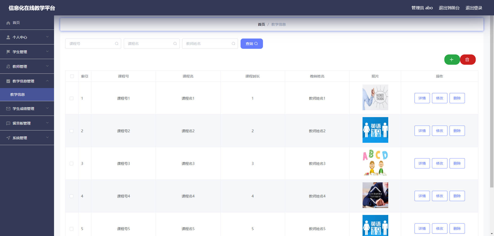
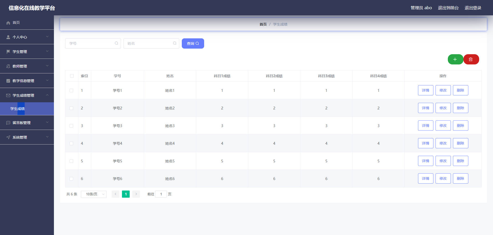
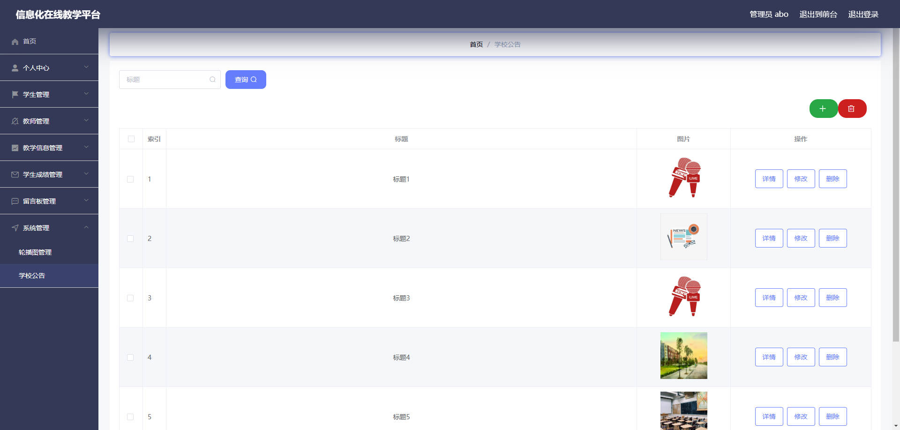

# 基于Springboot的信息化在线教学平台

## Springboot-0079


## 技术栈

Springboot mybatisplus vue mysql maven


## 数据库表(9张)


## 功能介绍

```properties
管理员功能有个人中心，学生信息管理，教师信息管理，教学信息管理，学生成绩管理，留言板管理，系统管理等。教师可以对学生成绩进行管理和留言回复。学生可以在线考试和留言。
```


## 图片

### 前台


### 后台









## 访问路径

### 前台

```properties
http://localhost:8080/springboot9qw88/front/pages/login/login.html

账号 学生6
密码 123456
```

### 后台

```properties
http://localhost:8080/springboot9qw88/admin/dist/index.html#/login

账号 abo
密码 abo
```


## 功能图


## 文档目录


## 打赏或交流


